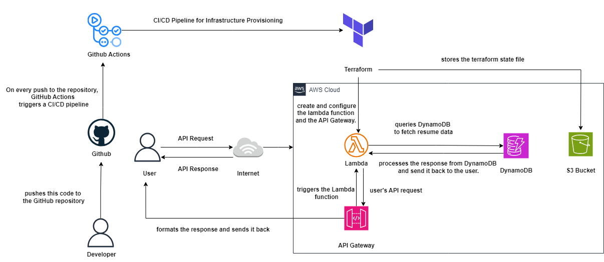
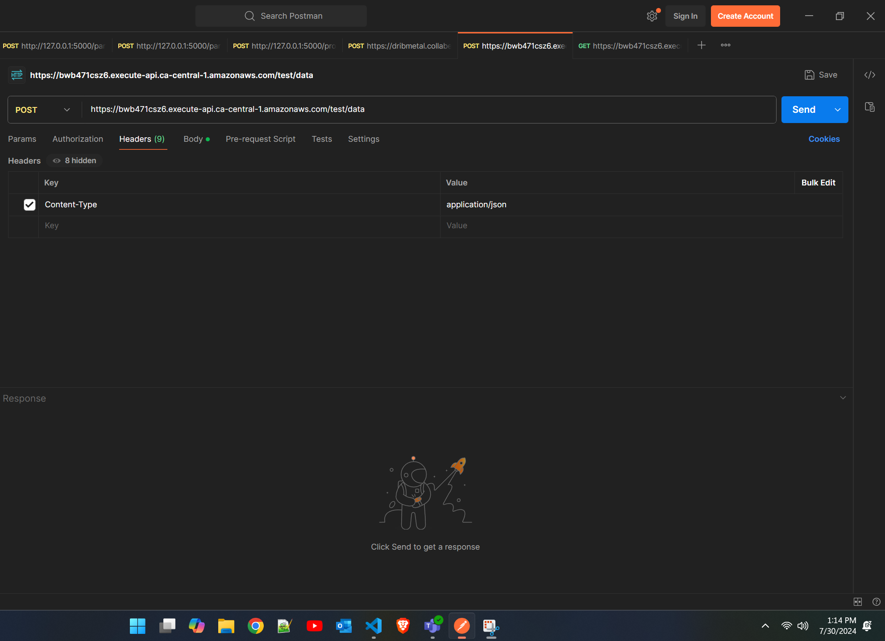

# AWS Cloud Resume API

This project is for the cloud resume challenge api and this readme  will guide you through building and deploying a serverless API using AWS Lambda and DynamoDB, integrated with GitHub Actions and Terraform .


## Overview

This project automates the deployment of all infrastructure using terraform running on GitHub Actions. The Lambda function serves as the backend for a resume API, providing endpoints via api gateway to fetch resume details stored in a dynamoDB table .

## Architecture



The architecture involves:

- **AWS Lambda**: Runs the backend code for the API but can be used for any purpose like a temporary compute.
- **AWS API Gateway**: Provides a RESTful API endpoint connectds it to whatever backend required in this case a lambda function.
- **DynamoDB**: Stores the resume data in json format.
- **Terraform**: Creates the infrastructure using code when ran through either github actions or just a computer.
- **GitHub Actions**: Automates the CI/CD pipeline which may include running terraform code as in this case or running test cases as well it acts as as a computer/instance on a cloud.

## Prerequisites

Before you begin, ensure you have met the following requirements:

- An AWS account with necessary permissions.
- [Terraform](https://www.terraform.io/downloads.html) installed.
- A GitHub account with access to the repository and a workflow in yaml which also has acess to the aws credentials stored as secrets.


### Project setup steps 🚀

#### 1. Set Up AWS

- **Sign Up for AWS**: If you don't already have an AWS account, sign up at [aws.amazon.com](https://aws.amazon.com/).
- **Set Up Credentials**: Configure your access key id and secrets on github secrets.

#### 2. Create a JSON Resume

- Create a JSON file containing your resume data. Follow a schema [Here](https://jsonresume.org/schema)

#### 3. Create Terraform Configuration

- Create `main.tf` and `provider.tf` for infrastructure as code as a way to automatically create the lambda function and the API Gateway configurations .

#### 4. Set Up GitHub Actions

- Create a GitHub Actions workflow (`.github/workflows/terraform.yml`) to automatically deploy infrastructure to your aws cloud on every push might want to change that as it does throw errors if infra already exists.Also put your aws keys and secrets in github to deploy the infrastructure.

#### 5. Test the API


To test the API, send a GET request to the API URL:
``` bash
 curl https://bwb471csz6.execute-api.ca-central-1.amazonaws.com/test/data?resumeId=RaunakBhargava 

 ```


##### Extra Features 

- Use post functionallity to upload your own resume to my dynamo db and view it using the get functionality 

#Get functionallity uses a query parameter
resumeId = id given 

I know this code has a lot of vulnerablities but the post function is not meant to be in this state for more than a few days 

### Using the post functionality 

_Add a Header_ 

Content-Type = application/json

The body will be raw json and the structure should be as follows 
{
    "resumeId" = "admin123",
    "resume" = ""
}

## Sample Header screenshot 



## Sample Body Screenshot 


